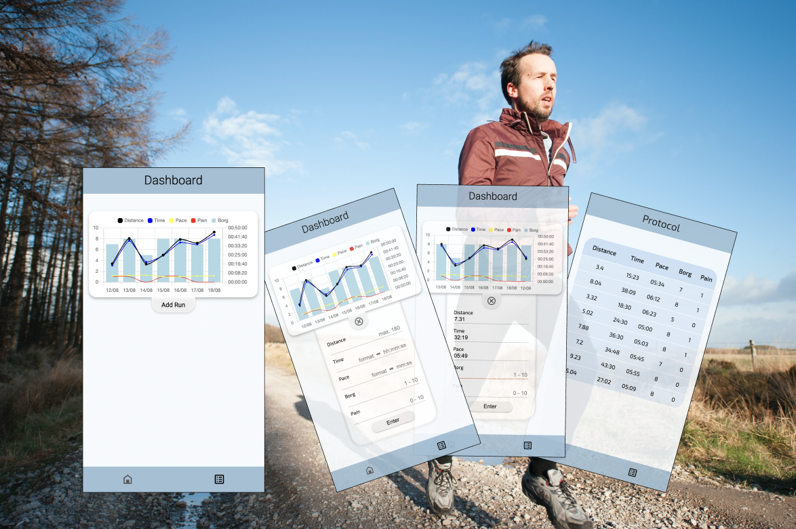

# Hello 👋🏼 and welcome to RunGraph 🏃🏃🏼‍♀️

### 💭 Backstory
After a calve injury in 2015 the wound reopened a few times because of wrong treatment and insuffient recovery. It took me around 6 years to stabilize my calve to a point where I could run again without having to worry too much about running into the next injury.   
Over time I developed a feeling for the pain characteristic and I knew when I had to cancel the activity and be more careful overall. I wanted to keep track of my past runs to observe my overall progress, so I started a protocol to log what distance at what intensity caused me xy amount of pain. Fast forward a few months and the idea to create RunGraph was born.  

**RunGraph** visualises run data by turning it into a diagram. Enter your _distance_, _time_, _pace_, _intensity_, optional _pain level_ and get a quick impression of your progress.
Aside from visualising your past runs, RunGraph aims to inform you about your workouts, PBs and some more. Hence this project is gradually evolving.

### 💡 More features to come
- Workout creator mode
- Next workout
- Hall of PBs

## 📂 Tech-Stack

-   [Next.js](https://nextjs.org/)
-   [Jest](https://jestjs.io/)
-   [Testing Library](https://testing-library.com/)
-   [Stylelint](https://stylelint.io/)
-   [Eslint](https://eslint.org/)
-   [Prettier](https://prettier.io/)
-   [Husky](https://typicode.github.io/husky/)
-   [Zustand](https://zustand-demo.pmnd.rs/)
